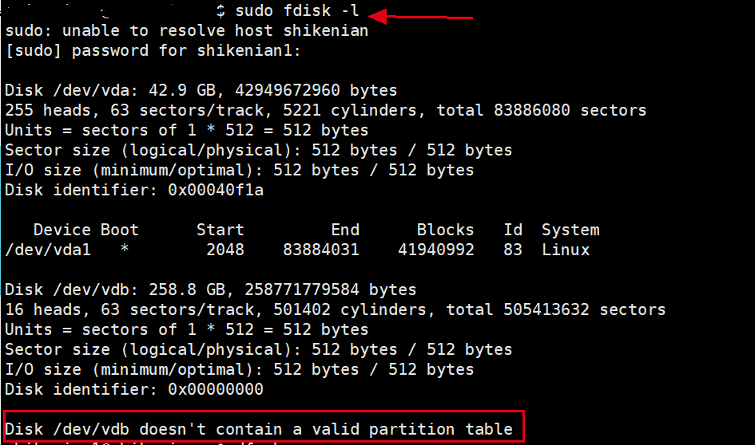
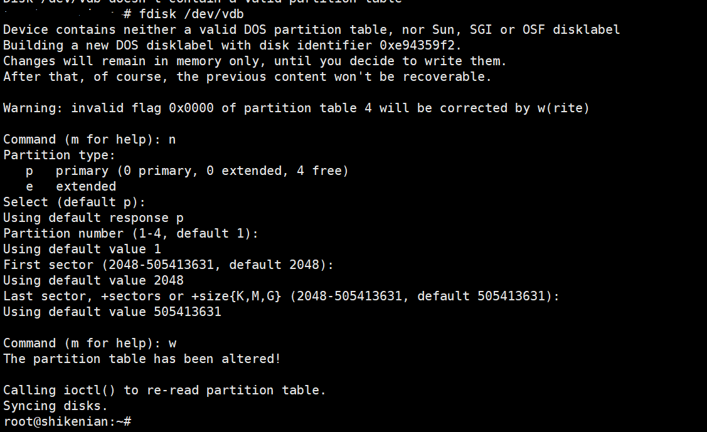
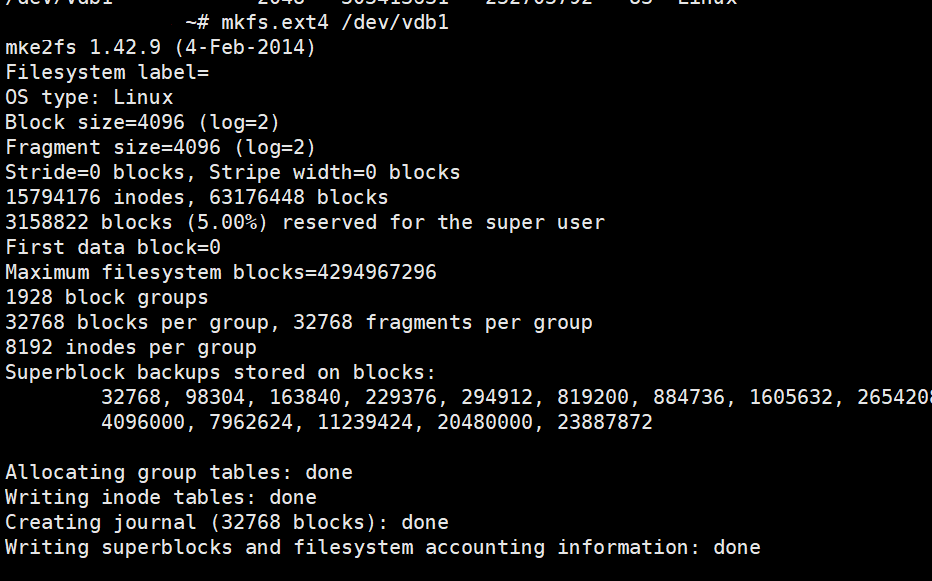

1. 购买云盘
2. 在ESC管理控制台（即官网网页），挂在该磁盘
3. 查看磁盘，请使用sudo或者管理员账户，否则看不到
```
sudo fdisk -l
如下图所示,其中/dev/vdb是磁盘设备名，可能不一样
当出现 Disk /dev/vdb doesn't contain a valid partition table，则说明已经检测到了该磁盘，接下来需要进行格式化和挂在硬盘
```



4. 新建挂在目录
```
mkdir /data
```

5. 格式化磁盘
```
选择要操作的磁盘，其中/dev/vdb是磁盘设备名，参考上述3
sudo fdisk /dev/vdb

查看磁盘情况,应该可以看到新的磁盘/dev/vdb1,后面使用需要用到这个磁盘设备名称
fdisk -l

格式化磁盘，注意此处试用的ext4方式格式化的，后面需要用到
mkfs.ext4 /dev/vdb1
```



6. 挂载磁盘
```
将磁盘信息写入
sudo vim /etc/fstab
## 在/etc/fstab里面添加下面内容，其中/dev/vdb1是磁盘设备名称，/data是挂载的目录，ext4是格式化的格式 
/dev/vdb1 /data ext4 defaults 0 0

载入磁盘
mount -a

查看磁盘
df -h

```
至此，挂载磁盘完毕

